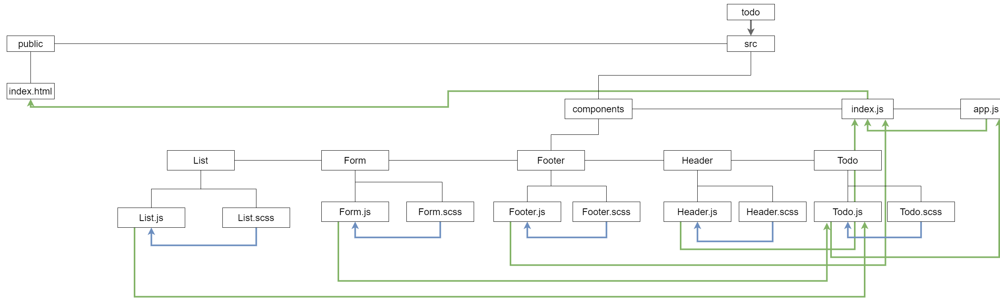

# Lab: Class 31

## Index

- [LAB - Hooks API](#LAB---Hooks-API)
- [Business Requirements](#Business-Requirements)
- [Phase 1 Requirements](#Phase-1-Requirements)
- [Technical Requirements / Notes](#Technical-Requirements-/-Notes)
- [The lab tree](#The-lab-tree)
- [More about the Lab](#More-about-the-Lab)
  - [Author](#Author)
  - [Github](#Github)
  - [UML](#UML)
  - [App](#App)
  - [Deployment link](https://todo401.netlify.app/)
- [Author Links](#Author-Links)
- [Back to main README](../../../README.md)
- [Back to head or the repo](https://github.com/shadykh/todo)

---

# LAB - Hooks API

**To Do List Manager Phase 1:** Begin the build of an application designed for creating and organizing a "To Do" list in your browser.

In this initial phase, we're going to have to start by converting a legacy application into a more modern architecture. Our initial "Proof of Concept" was written using class based components and was not properly styled. Now that our client has given us the "green light" for development, we're going to refactor the application using Hooks and upgrading the style.

**[⬆ Back to Index](#index)**

---

## Before you begin

Refer to *Getting Started*  in the [lab submission instructions](../../../reference/submission-instructions/labs/README.md) for complete setup, configuration, deployment, and submission instructions.

Analyze the provided `starter_code` and create a UML diagram of the **To Do** app on a whiteboard before you start the conversion process

> Create a new repository for this project, called `todo` and work in a branch called `hooks`.

**[⬆ Back to Index](#index)**

---

## Business Requirements

Refer to the [To Do System Overview](../../../README.md) for a complete review of the application, including Business and Technical requirements along with the development roadmap.

**[⬆ Back to Index](#index)**

---


## Phase 1 Requirements

Today, we begin the first of a 4-phase build of the To Do List Manager, a web-based task manager application, written in React. In this first phase, our goal is to setup a foundational system using React hooks that we can build upon in later phases, adding databases, logins, and more advanced features.

The following user/developer stories detail the major functionality for this phase of the project.

- As a user, I would like an easy way to add a new to do item using an online interface
- As a user, I would like my to do items to have an assignee, due date, difficulty meter, status and the task itself
- As a user, I would like to delete to do items that are no longer needed
- As a user, I would like to easily mark to do items as completed
- As a user, I would like to edit an existing to do item

**[⬆ Back to Index](#index)**

---


## Technical Requirements / Notes

> You've been provided "starter code" for this phase. Copy the starter code folder contents into your repository to use as your starting point for the application. We'll be refactoring this to fulfill the requirements.

- Convert the architecture from **Class Based Components** into **Functional Components**
- Apply styling and layout using React Bootstrap Components
- Ensure the current functionality works unchanged
- Manage state using the `useState()` hook
- Use a `useEffect()` hook to change the title of the browser with the complete/incomplete counts
- Use a `useEffect()` hook to pre-load the seeded To Do Items
- Match the provided mockup for the design
  - Use `react-bootstrap` components and theming
  - Some interactivity notes:
    - Each item in list should show the text of the item as well as the assignee
    - When clicked, toggle the "complete" status of the item.
    - Items should be styled differently when complete/incomplete making their status visually obvious


**[⬆ Back to Index](#index)**


---

#### **The lab tree**

```
├── .gitignore
├── .eslintrc.json
├── __tests__
│   ├── todo.test.js
│   ├── auth.test.js
├── src
│   ├── index.js
│   ├── app.js
│   ├── context
│   │   ├── auth
│   │   │   └── context.js
│   │   │   └── auth.js
│   │   │   └── login.js
│   │   ├── settings
│   │   │   └── context.js
│   ├── components
│   │   ├── if
│   │   │   └── if.js
│   │   ├── todo
│   │   │   └── form.js
│   │   │   └── list.js
│   │   ├── footer
│   │   │   └── footer.js
│   │   ├── header
│   │   │   └── header.js
└── package.json
```

**[⬆ Back to Index](#index)**


---


### **More about the Lab**

- #### Author

  - Shady Khaled

  **[⬆ Back to Index](#index)**

---


- #### Github

  - For the repo ***todo*** clicks => [here](https://github.com/shadykh/todo).
  - Pull Requests:
    - [https://github.com/shadykh/todo/pull/1](https://github.com/shadykh/todo/pull/1)

**[⬆ Back to Index](#index)**

---


- #### UML

  - 

**[⬆ Back to Index](#index)**

---


- #### App

  - run `npm start`
  - Deployment link 🌍: [todo](https://todo401.netlify.app/)

- I did this lab with help of
  - dependencies
    - node-sass
    - react
    - react-dom
    - react-scripts
    - web-vitals
  - framework
    - Node.js
    - React
  - tools
    - Github.
    - VsCode.
    - Ubuntu.

**[⬆ Back to Index](#index)**

<br>

---
<br>

## Author Links

- ### Shady Khaled github ✅

  - [Shady Khaled](https://github.com/shadykh)

- ### Shady Khaled reading notes 📚

  - [Shady Khaled reading notes](https://shadykh.github.io/reading-notes/)

- ### Shady Khaled portfolio 💬

  - [Shady Khaled portfolio](https://portfolio-shady.herokuapp.com/)
