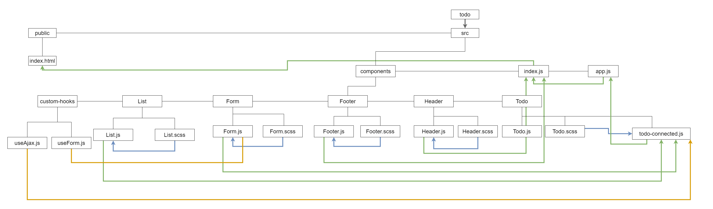

# Lab: Class 32

## Index

- [LAB - Hooks API](#LAB---Hooks-API)
- [Business Requirements](#Business-Requirements)
- [Phase 2 Requirements](#Phase-2-Requirements)
- [Technical Requirements / Notes](#Technical-Requirements-/-Notes)
- [The lab tree](#The-lab-tree)
- [More about the Lab](#More-about-the-Lab)
  - [Author](#Author)
  - [Github](#Github)
  - [UML](#UML)
  - [App](#App)
  - [Deployment link](https://todo401.netlify.app/)
- [Author Links](#Author-Links)
- [Back to main README](../../../README.md)
- [Back to head or the repo](https://github.com/shadykh/todo)

---

# LAB - Hooks API

**To Do List Manager Phase 2:** Connecting the To Do Application to an external API and Database

In this phase, we'll be connecting our application to an API so that our list will be saved permanently. This will require a working and deployed API server with a proper "To Do" data model and appropriate REST routes

**[⬆ Back to Index](#index)**

---

## Before you begin


Refer to *Getting Started*  in the [lab submission instructions](../../../reference/submission-instructions/labs/README.md) for complete setup, configuration, deployment, and submission instructions.

> Building off of your previous day's branch, create a new branch for today called 'custom-hooks' and continue to work in your 'todo' repository.

**[⬆ Back to Index](#index)**

---

## Business Requirements

Refer to the [To Do System Overview](../../../README.md) for a complete review of the application, including Business and Technical requirements along with the development roadmap.

**[⬆ Back to Index](#index)**

---


## Phase 2 Requirements

In Phase 2, we're going to connect the To Do Manager to a deployed API, backed by a database. The core functionality and stories do not change (reference Phase 1), but a new one has been added to note this shift in persistence.

- As a user, I would like to be able to add, update, and delete To Do items
- As a user, I would like my To Do Items to be permanently stored so that I can re-access them at any time, using any device

Note that the display of each To Do item has changed slightly.


**[⬆ Back to Index](#index)**

---


## Technical Requirements / Notes

Technical requirements for the core application are unchanged from **Phase 1**, with the following exceptions and notes:

Workflow changes:

- On application start, display all of the to do items from the API/Database
- When **adding** an item, issue a `POST` request to the API server
- When **marking items complete**, issue a `PUT` request to the API server for the item
- When **deleting** items, issue a `DELETE` request to the API server for the item

Implementation Requirements

- Design Requirement
  - Follow the included mockup
  - Implement using [React Bootstrap Components](https://react-bootstrap.github.io/), not your own bespoke markup/css
- API
  - You have previously built a working, and deployed API server that handles data models such as `categories` and `products`
  - Add a new data model for "To Do" items as noted in the Business Requirements document, and deploy it to Heroku

- Hooks:
  - Use the `useEffect()` hook to pre-load the To Do Items from the API on application start
  - Replace the current form change/submit handlers with the `useForm()` custom hook to manage the "Add Item" form
  - Create a new custom hook called `useAjax()` to abstract the API calls
    - Using this hook in your component should make the calls to the server
    - This hook should:
      - Accept the URL to the API server, the REST method, and (when relevant) the BODY (JSON) of the request
      - Handle CORS Settings, Content-Type, Headers and possibly authentication
      - You should use `axios` to perform the actual AJAX calls

> TIP: Before you write the `useAjax()` hook, get the application connected to and using your deployed api, with `axios` in your event handlers. **Once you have it working end to end**, migrate that same logic into using a hook. You'll find that writing the hook will require the use of effects and some event-driven thinking (with state) to operate. Here's a [great article](https://medium.com/swlh/usefetch-a-custom-react-hook-36d5f5819d8) to get you started


**[⬆ Back to Index](#index)**


---

#### **The lab tree**

```
├── .gitignore
├── .eslintrc.json
├── __tests__
│   ├── todo.test.js
│   ├── auth.test.js
├── src
│   ├── index.js
│   ├── app.js
│   ├── context
│   │   ├── auth
│   │   │   └── context.js
│   │   │   └── auth.js
│   │   │   └── login.js
│   │   ├── settings
│   │   │   └── context.js
│   ├── components
│   │   ├── if
│   │   │   └── if.js
│   │   ├── todo
│   │   │   └── form.js
│   │   │   └── list.js
│   │   ├── footer
│   │   │   └── footer.js
│   │   ├── header
│   │   │   └── header.js
└── package.json
```

**[⬆ Back to Index](#index)**


---


### **More about the Lab**

- #### Author

  - Shady Khaled

  **[⬆ Back to Index](#index)**

---


- #### Github

  - For the repo ***todo*** clicks => [here](https://github.com/shadykh/todo).
  - Pull Requests:
    - [https://github.com/shadykh/todo/pull/3](https://github.com/shadykh/todo/pull/3)

**[⬆ Back to Index](#index)**

---


- #### UML

  - 

**[⬆ Back to Index](#index)**

---


- #### App

  - run `npm start`
  - Deployment link 🌍: [todo](https://todo401.netlify.app/)

- I did this lab with help of
  - dependencies
    - node-sass
    - react
    - react-dom
    - react-scripts
    - web-vitals
  - framework
    - Node.js
    - React
  - tools
    - Github.
    - VsCode.
    - Ubuntu.

**[⬆ Back to Index](#index)**

<br>

---
<br>

## Author Links

- ### Shady Khaled github ✅

  - [Shady Khaled](https://github.com/shadykh)

- ### Shady Khaled reading notes 📚

  - [Shady Khaled reading notes](https://shadykh.github.io/reading-notes/)

- ### Shady Khaled portfolio 💬

  - [Shady Khaled portfolio](https://portfolio-shady.herokuapp.com/)
