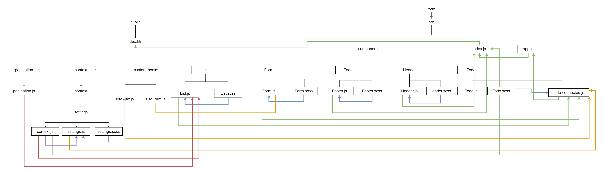

# Lab: Class 33

## Index

- [LAB - Hooks API](#LAB---Hooks-API)
- [Business Requirements](#Business-Requirements)
- [Phase 3 Requirements](#Phase-3-Requirements)
- [Technical Requirements / Notes](#Technical-Requirements-/-Notes)
- [The lab tree](#The-lab-tree)
- [More about the Lab](#More-about-the-Lab)
  - [Author](#Author)
  - [Github](#Github)
  - [UML](#UML)
  - [App](#App)
  - [Deployment link](https://todo401.netlify.app/)
- [Author Links](#Author-Links)
- [Back to main README](../../../README.md)
- [Back to head or the repo](https://github.com/shadykh/todo)

---

# LAB - Hooks API

**To Do List Manager Phase 3:** Add some configuration settings to the application

In this phase, we'll be adding some top-level settings for the application, so that the user can make some display choices that the app will use by default.

**[⬆ Back to Index](#index)**

---

## Before you begin

Refer to *Getting Started*  in the [lab submission instructions](../../../reference/submission-instructions/labs/README.md) for complete setup, configuration, deployment, and submission instructions.

> Building off of your previous day's branch, create a new branch for today called 'context' and continue to work in your 'todo' repository.

**[⬆ Back to Index](#index)**

---

## Business Requirements

Refer to the [To Do System Overview](../../../README.md) for a complete review of the application, including Business and Technical requirements along with the development roadmap.

**[⬆ Back to Index](#index)**

---


## Phase 3 Requirements

In Phase 3, we'd like to extend the functionality of the application by potentially allowing users to set a few configuration options to change how the application behaves. The user stories from **Phases 1 and 2** remain unchanged. For this phase, we are now adding the following new user stories.

- As a user, I would like to see my To Do List Items a few at a time so that I don't have to wade through them all
- As a user, I would like my default view to only be "Incomplete" Items so that I can quickly determine what I have to do.
- As a user, I would like my list sorted by difficulty so that I can more easily prioritize
- As a user, I would like the option to change my default preferences with regards to how many Items I see per page, which items are filtered, and how they are sorted


**[⬆ Back to Index](#index)**

---


## Technical Requirements / Notes

Technical requirements for the core application are unchanged from the prior phases, with the following additions and notes:

Based on global configuration

- Show a maximum of a certain number of items per screen
- Hide or show completed items in the list
- Sort the items based on any of the keys (i.e. difficulty)

Implement this using `context`

- Create a `context` for managing application settings and provide this at the application level
- Display or Hide completed items (boolean)
- Number of items to display per screen (number)
- Default sort field (string)
- You may manually set (hard code) those state settings in the context provider during development

Pagination Notes:

- Only display the first `n` items in the list, where `n` is the number to display per screen in your context.
  - If you have more than `n` items in the list, add a button labeled `Next` that will replace the list with the next `n` items in the list.
  - If you are past the first `n` items (i.e. on page 2 or higher), add a button labeled `Previous` that will replace the list with the previous `n` items in the list.

**[⬆ Back to Index](#index)**


---

#### **The lab tree**

```
├── .gitignore
├── .eslintrc.json
├── __tests__
│   ├── todo.test.js
│   ├── auth.test.js
├── src
│   ├── index.js
│   ├── app.js
│   ├── context
│   │   ├── auth
│   │   │   └── context.js
│   │   │   └── auth.js
│   │   │   └── login.js
│   │   ├── settings
│   │   │   └── context.js
│   ├── components
│   │   ├── if
│   │   │   └── if.js
│   │   ├── todo
│   │   │   └── form.js
│   │   │   └── list.js
│   │   ├── footer
│   │   │   └── footer.js
│   │   ├── header
│   │   │   └── header.js
└── package.json
```

**[⬆ Back to Index](#index)**


---


### **More about the Lab**

- #### Author

  - Shady Khaled

  **[⬆ Back to Index](#index)**

---


- #### Github

  - For the repo ***todo*** clicks => [here](https://github.com/shadykh/todo).
  - Pull Requests:
    - [https://github.com/shadykh/todo/pull/3](https://github.com/shadykh/todo/pull/3)

**[⬆ Back to Index](#index)**

---


- #### UML

  - 

**[⬆ Back to Index](#index)**

---


- #### App

  - run `npm start`
  - Deployment link 🌍: [todo](https://todo401.netlify.app/)

- I did this lab with help of
  - dependencies
    - node-sass
    - react
    - react-dom
    - react-scripts
    - web-vitals
  - framework
    - Node.js
    - React
  - tools
    - Github.
    - VsCode.
    - Ubuntu.

- Outsource help from : 
  - [Click me🌍](https://www.youtube.com/watch?v=IYCa1F-OWmk)


**[⬆ Back to Index](#index)**

<br>

---
<br>

## Author Links

- ### Shady Khaled github ✅

  - [Shady Khaled](https://github.com/shadykh)

- ### Shady Khaled reading notes 📚

  - [Shady Khaled reading notes](https://shadykh.github.io/reading-notes/)

- ### Shady Khaled portfolio 💬

  - [Shady Khaled portfolio](https://portfolio-shady.herokuapp.com/)
