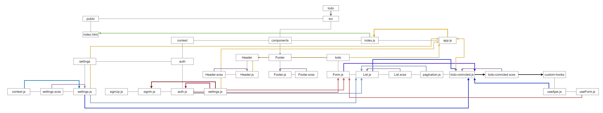

# Lab: Class 34

## Index

- [LAB - Hooks API](#LAB---Hooks-API)
- [Business Requirements](#Business-Requirements)
- [Phase 4 Requirements](#Phase-4-Requirements)
- [Technical Requirements / Notes](#Technical-Requirements-/-Notes)
- [The lab tree](#The-lab-tree)
- [More about the Lab](#More-about-the-Lab)
  - [Author](#Author)
  - [Github](#Github)
  - [UML](#UML)
  - [App](#App)
  - [Deployment link](https://todo401.netlify.app/)
- [Author Links](#Author-Links)
- [Back to main README](../../../README.md)
- [Back to head or the repo](https://github.com/shadykh/todo)

---

# LAB -  `<Login />` and `<Auth />`

**To Do List Manager Phase 4:** Adding security and access controls to the application.

In this final phase, we'll be requiring that users be logged in, in order to see the to do items. Additionally, based on their user type, they will be allowed (or denied) to perform actions such as editing or deleting them.

**[⬆ Back to Index](#index)**

---

## Before you begin

Refer to *Getting Started*  in the [lab submission instructions](../../../reference/submission-instructions/labs/README.md) for complete setup, configuration, deployment, and submission instructions.

> Building off of your previous day's branch, create a new branch for today called 'auth' and continue to work in your 'todo' repository.

**[⬆ Back to Index](#index)**

---

## Business Requirements

Refer to the [To Do System Overview](../../../README.md) for a complete review of the application, including Business and Technical requirements along with the development roadmap.

**[⬆ Back to Index](#index)**

---


## Phase 4 Requirements

In Phase 4, we'd like to extend the functionality of the application by requiring users be logged in to view items and also restrict access based on user type. The user stories from **Phases 1, 2 and 3** remain unchanged. For this phase, we are now adding the following new user stories.

- As a user, I want to provide a way for other users to create new accounts
- As a user, I want to provide a way for all users to login to their account
- As a user, I want to make sure that my To Do items are only viewable to users that have logged in with a valid account.
- As a user, I want to ensure that only fellow users that are allowed to "create", based on their user type, can add new To Do Items
- As a user, I want to ensure that only fellow users that are allowed to "update", based on their user type, can mark To Do Items complete
- As a user, I want to ensure that only fellow users that are allowed to "delete", based on their user type, can delete new To Do Items


**[⬆ Back to Index](#index)**

---


## Technical Requirements / Notes

Technical requirements for the core application are unchanged from the prior phases, with the following additions and notes:

- Provide an account registration screen
  - Requires: Username, Password, Email
  - Optionally: A drop-down to select a user "Role" so that you can easily simulate user types
- Provide an account login screen
  - Accepts Username and Password
  - On successful login, store the token as a cookie
- If a user returns and has a valid login cookie, bypass the login screen and consider them "Logged In"

Using Login/Auth Context, "protect" the To Do application by restricting access to the various application features based on the users' login status and capabilities.

- Implement `<Login />` and `<Auth />` components with Context
- Link to the Login screen in your main menu
  - **Hide the entire interface until the user has logged in.**
  - **Implement the following RBAC rules:**
    - Logged In Users with 'read' permissions can see the summary/count
    - Logged In Users with 'read' permissions can see the list of To Do Items
    - Logged In Users with 'update' permissions can click the records to mark them as complete
    - Logged In Users with 'create' permissions can create new items
    - Logged In Users with 'delete' permissions can delete items

**[⬆ Back to Index](#index)**


---

#### **The lab tree**

```
├── .gitignore
├── .eslintrc.json
├── __tests__
│   ├── todo.test.js
│   ├── auth.test.js
├── src
│   ├── index.js
│   ├── app.js
│   ├── context
│   │   ├── auth
│   │   │   └── context.js
│   │   │   └── auth.js
│   │   │   └── login.js
│   │   ├── settings
│   │   │   └── context.js
│   ├── components
│   │   ├── if
│   │   │   └── if.js
│   │   ├── todo
│   │   │   └── form.js
│   │   │   └── list.js
│   │   ├── footer
│   │   │   └── footer.js
│   │   ├── header
│   │   │   └── header.js
└── package.json
```

**[⬆ Back to Index](#index)**


---


### **More about the Lab**

- #### Author

  - Shady Khaled

  **[⬆ Back to Index](#index)**

---


- #### Github

  - For the repo ***todo*** clicks => [here](https://github.com/shadykh/todo).
  - Pull Requests:
    - [https://github.com/shadykh/todo/pull/3](https://github.com/shadykh/todo/pull/3)

**[⬆ Back to Index](#index)**

---


- #### UML

  - 

**[⬆ Back to Index](#index)**

---


- #### App

  - run `npm start`
  - Deployment link 🌍: [todo](https://todo401.netlify.app/)

- I did this lab with help of
  - dependencies
    - node-sass
    - react
    - react-dom
    - react-scripts
    - web-vitals
  - framework
    - Node.js
    - React
  - tools
    - Github.
    - VsCode.
    - Ubuntu.

- Outsource help from : 
  - [Click me🌍](https://www.youtube.com/watch?v=IYCa1F-OWmk)


**[⬆ Back to Index](#index)**

<br>

---
<br>

## Author Links

- ### Shady Khaled github ✅

  - [Shady Khaled](https://github.com/shadykh)

- ### Shady Khaled reading notes 📚

  - [Shady Khaled reading notes](https://shadykh.github.io/reading-notes/)

- ### Shady Khaled portfolio 💬

  - [Shady Khaled portfolio](https://portfolio-shady.herokuapp.com/)
